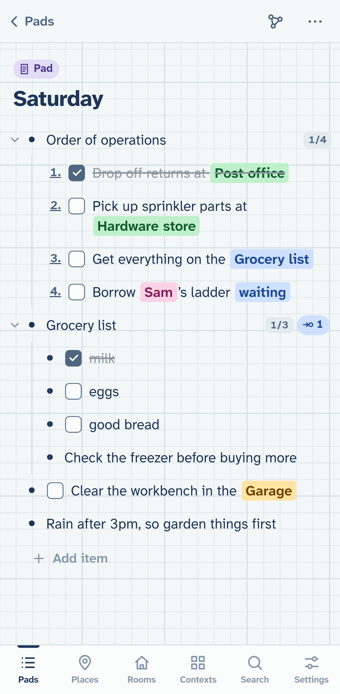
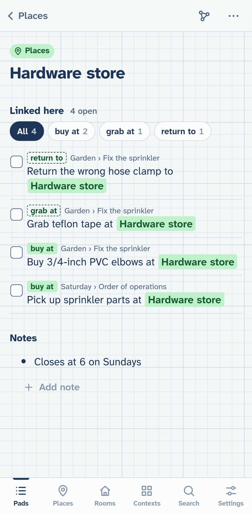
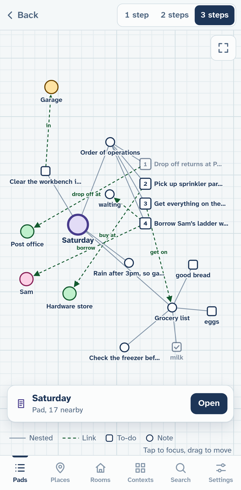

# Graph Paper

A phone-first outliner that stores everything as a graph. Write nested lists of to-dos and notes; link any line to any other node with `@`; open a place like "Hardware store" to see every open to-do that points at it, across all your lists. It's an installable PWA that works offline, with all data in SQLite on the device, and it syncs between your devices through a small server of your own when it can reach one.

<p align="center">
  
  
  
</p>

A pad with to-dos, notes and links to contexts of different kinds: places, a person, and a room from a kind of context you made, with its own tab (left). A place's page, with what links there labelled by relation; *buy at* is one you kept ("pick up at" counts as it too), the outlined ones are suggestions (middle). The pad's graph, with links labelled (right). `npm run screenshots` rebuilds all three from example data.

Inside, it’s still `graph-scratchpad`: the repo, the on-device database, export files, and the servers’ paths and services.

See `CLAUDE.md` for the design decisions and data model, and `PLAN.md` for milestones.

## Using it

- **Tap a line** to edit. **Enter** starts a new line (it splits the line if the caret is mid-text). On an empty nested last line, Enter outdents it.
- **Backspace** on an empty line deletes it. At the start of a line, it merges the line into the one above, unless other items link to it or it has children.
- The **bar above the keyboard** has outdent, indent, move up, move down, insert link, checkbox, more (open, move to another pad, turn into a place or person, collapse, delete), and hide keyboard.
- **To-dos and notes.** A line is either a to-do (with a checkbox) or a plain bullet note. The checkbox button in the bar switches it; so does typing `[] ` or `- ` at the start of a line. New lines follow the line you came from, so checklists stay checklists. The first line of a pad is a to-do, and notes under a place or person are plain bullets. ⋯ → **Add/Remove checkboxes** switches every line inside at once. Only to-dos count as "open", and a parent shows how many of its to-dos are done (2/5).
- **Turn into a place / person** creates a standalone place (or person) named after the line, and leaves the line in your list as a link to it. On a hardware keyboard: Tab / Shift-Tab, Alt-Shift-↑/↓ to move, Ctrl-Enter to check off, Ctrl-Shift-Enter to switch to-do/note, Ctrl-↑/↓ to collapse or expand.
- **Move to…** (in the ⋯ menu) opens a browser next to the line: tap a pad or item to look inside it, then **Move into “…”**. Search works too.
- **Number the items inside** (⋯ on a line, or the page menu for a whole pad) turns its children into a numbered list. In the graph, numbered lists hang off their parent as an ordered column.
- **Type `@`** at the start of a word, or tap the @ button, to search all items, places, and people. You can also create a new place, person, or item from the same search. New items go into an "Inbox" pad.
- **Tap a chip** to open what it links to. **Tap a bullet** to open that item, with its children, outgoing links, and what links here.
- **Linked here.** A line that other lines link to shows a count at its right; tap it to see them: open to-dos first, then plain mentions, then the done ones (folded away). Finished to-dos don't count. This makes any line a status or tag: put "waiting" in a States pad, link to-dos to it with @, and its page lists what you're waiting on. Each link is labelled with what its wording says, read from the words around it ("buy elbows at [[Hardware store]]" is *buy at*, "waiting on [[Sam]]" is *waiting on*, "[[Sam]] owes me" is *owes*); when a page has more than one kind, chips at the top filter by them, and the graph shows the labels on its link lines. With sync on a server that has an Anthropic API key, Claude Haiku then reads each new or edited linked line on the server and refines the label, reusing the ones already in use ("pick up at" and "grab at" become *buy at*); the labels arrive through sync. `node scripts/example-pad.mjs` adds a "Relations playground" pad to try it on.
- **Your relations.** Labels start as suggestions (outlined). Tap one, or a chip’s **Keep or rename**, to **Keep** it, **Call it something else** (one of your relations, or a new name: "pick up at" then counts as *buy at*), or say it’s **Not a relation**. Kept relations are drawn solid and listed in Settings → **Relations**, each with a page of its links grouped by what they link to, and the other ways you write it as an editable list. Rename or merge from there. **Label just this link** picks the relation for a single line, whatever its wording. Haiku is told your relations, so its labels follow your vocabulary.
- **Contexts.** A context is anything you link to and come back to: a place, a person, a room, a project. Kinds of context are yours to make: Places and People to start, then Rooms, Projects, Stores… Any line can be one, right where it is: ⋯ → **Make it a context…** and pick a kind (or tap the kind tag on its page to change it). Each kind has a page listing its contexts with their open to-dos, and a box to add another. The **Contexts** tab lists every kind, plus the other things you link to; when the way you link to one matches a kind (things you sweep "in" look like Rooms), it suggests that kind. Contexts take their kind’s icon and colour in chips, rows and the graph, and @ offers "New in Rooms: …".
- **Tabs.** Give up to three kinds a tab in the bar (Settings → Tabs, a kind’s ⋯ menu, or the pin on the Contexts tab); the rest live under Contexts. Places has a tab to start.
- **Graph** (the node icon at the top right of any item) shows its neighborhood 1–3 steps out. Solid lines are nesting and dashed arrows are links; to-dos are boxes (ticked and dimmed when done) and notes are circles. Drag nodes around; tap one to make it the focus (back steps to the previous one); **Open** on the card goes to its page.
- **Sync.** When the site it's served from has a sync server, the app turns sync on by itself and says so once. Every change is saved on the device first and sent in the background: shortly after you edit, when the app comes back to the foreground or the network returns, and right away when another device changes something. Offline, nothing changes except that changes wait. A new device downloads your lists instead of showing the welcome pad. Settings → Sync shows the state, has **Sync now**, and can turn it off for this device.
- **Settings** shows whether storage is persistent and lets you export or import a JSON backup. **Trash** lets you restore deleted items.
- Pasting several lines creates one item per line, with `-` and `*` markers stripped. Lines with `[ ]` or `[x]` become to-dos (checked off for `[x]`); the rest follow the line you pasted into.

## Development

```sh
npm install
npm run dev        # Vite dev server
npm test           # data-layer unit tests (Vitest, Node, same sqlite-wasm build)
npm run typecheck
npm run e2e        # builds, then drives headless Chromium (Pixel 7 emulation, touch)
npm run icons      # regenerate PWA icons (dependency-free PNG drawing)
npm run screenshots  # rebuild the README screenshots from example data
```

The e2e suites (`e2e/*.mjs`) use `playwright-core` with the system Chromium (`/run/current-system/sw/bin/chromium`, or set `CHROMIUM=`). Screenshots land in `e2e/shots/`.

### Layout

- `src/db/store.ts`: all SQL and graph logic (tree ops, link reconciliation, search, export/import). Synchronous; runs against any `SqlDb`.
- `src/db/worker.ts`: browser bootstrap: sqlite-wasm with the `opfs-sahpool` VFS, plus a Web Lock so a second tab waits instead of fighting over file handles.
- `src/db/api.ts`: typed `postMessage` client (`api.indent(id)` etc.), derived from the Store's method types.
- `src/components/Outline.vue`: the editor. It applies each operation to a local copy of the tree immediately (with client-generated UUIDs) so focus moves inside the key handler and the Android keyboard stays up, then sends the same operation to the worker and reloads.
- `src/components/EditableText.vue`: one contenteditable line with atomic link chips; caret offsets are measured in stored-text units.
- `src/db/sync.ts`, `src/db/syncRunner.ts`, `src/db/hlc.ts`: the sync client (see below). `server/serve.mjs` serves the app and `/api/sync`; `server/sync-server.mjs` is the server's merge logic, on Node's built-in SQLite.

### How sync works

Each node is a handful of fields (text, done, to-do, kind, collapsed, numbered, deleted, purged, and its place: parent + sort key). Every field remembers when it last changed, as a hybrid logical clock time: wall-clock based, but it never runs backwards and always moves past anything seen from another device. Triggers on the tables (migration 5) record each local change in `sync_clock`, so the Store's methods know nothing about sync.

A sync round trip sends the fields not yet sent and gets back every field the server has newer than this device's cursor. Each field keeps whichever value is newest, so editing a line's text on the phone and checking it off on the desktop both survive; two edits to the same field keep the later one. Links aren't sent; each device rebuilds them from the text. After merging, the device repairs what a merge can break, as ordinary local edits that sync back: a to-do that's done but not a to-do (the newer of the two fields wins), and a loop from two devices moving lines into each other (the most recently moved line goes to the Inbox). Emptying the trash leaves tombstones so it reaches other devices. The server's database has an identity; if it's ever replaced, devices notice and send it everything again. `tests/sync.test.ts` checks three devices converge after hundreds of random edits; `SYNC_FUZZ=50 npx vitest run tests/sync.test.ts` soaks it.

Link labels on the server (`server/relations-ai.mjs`): when the sync server finds an API key (`RELATIONS_KEY_FILE`, default `anthropic-api-key` next to the `sync/` directory; on the Pi, `/var/lib/graph-scratchpad/anthropic-api-key`, mode 600, outside the repo and the Nix store), it batches lines whose links have no label for their current text, asks Claude Haiku (tool use, with the relations already in use as vocabulary), and writes the answers as a `rels` field on each line: `{ linkedId: { r, h } }`, where `h` hashes the text it read. Devices use a label only while their text still hashes the same, and their own guess otherwise. Capped at `RELATIONS_MAX_CALLS_PER_DAY` (300); a call labels up to 40 links for a fraction of a cent. `GET /api/sync` reports counts and the last error.

```sh
SYNC_DB=/tmp/sync.sqlite3 npm run serve   # app + sync server on 127.0.0.1:8742, for local testing
```

## Hosting (tailnet)

HTTPS is required for the service worker and OPFS; `tailscale serve` provides it, and the tailnet is the access control (the server listens on localhost only).

- **The Pi** (`utility-server-pi`, NixOS) is the home: **https://utility-server-pi.pirate-emperor.ts.net** serves the app and the sync server, whose database is `/var/lib/graph-scratchpad/sync/sync.sqlite3` with a copy saved daily to `sync/backups/` (seven kept).
- **The Framework** still serves the app at **https://framework.pirate-emperor.ts.net:10002**, passing `/api/sync` through to the Pi, so an install from there syncs with the same server.

```sh
npm run deploy:pi  # build + unit tests, then publish a release to the Pi over ssh
npm run deploy     # the same, to this machine
```

A release is the built app (`app/`, with `.gz` siblings) plus the server (`server/`), copied to `releases/<timestamp>/` with `current` repointed atomically. New static files are live on the next request; the server restarts only when its code changed. The installed app shows "A new version is ready" and reloads when you tap it.

On the Pi, Nix provides the runtime: `deploy/nixos/graph-scratchpad.nix` is a NixOS module (copied into the Pi's config as `/etc/nixos/modules/system/graph-scratchpad.nix` and enabled in `hosts/utility-server-pi/default.nix` with `services.graph-scratchpad.enable = true;`). It runs `serve.mjs` with nixpkgs' Node 22 as a hardened system service and publishes it with `tailscale serve` on port 443. App deploys don't need a rebuild; changes to the module do (`sudo nixos-rebuild switch --flake /etc/nixos#utility-server-pi`).

On the Framework it's a systemd user unit (`deploy/graph-scratchpad.service`, installed in `~/.config/systemd/user/`) published with `tailscale serve --bg --https=10002 http://127.0.0.1:8742`.

## Data safety

- Data lives in the browser's origin-private file system for that exact origin. A different host or port is a different database; with sync on, a new origin fills itself from the server.
- With sync on, the Pi keeps a copy of everything, plus daily snapshots. Importing a backup while sync is on merges it in (its version of each entry wins) instead of replacing everything.
- The app calls `navigator.storage.persist()` on first run; Settings shows whether it was granted. Installed PWAs on Android usually get it.
- Uninstalling the app or clearing site data deletes everything. Export a backup from Settings first.
